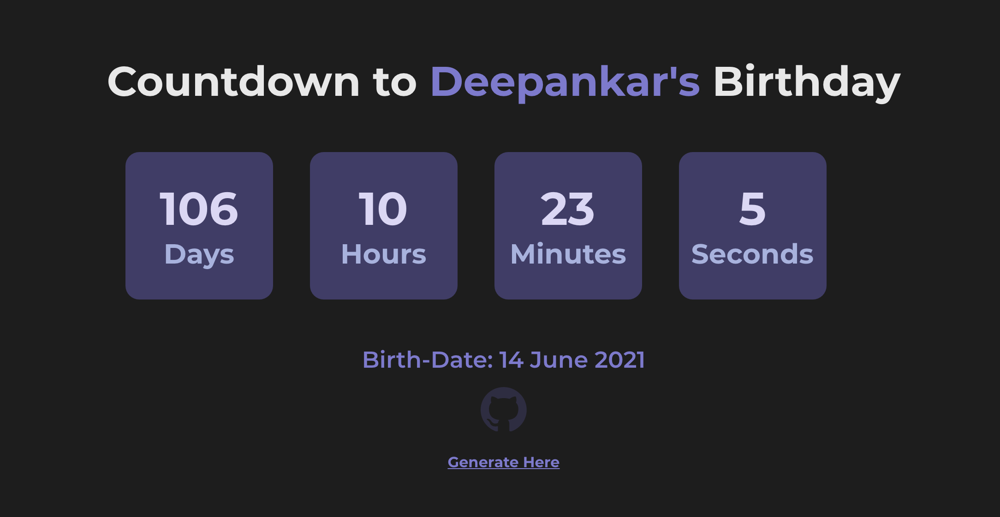

🎉Birthday Wisher with Countdown!🎉
Made with React with Hooks.
## Getting started

You can view a live demo over at https://birthday-wisher.netlify.app/

To get It running locally:

- Clone this repo
- `npm install` to install all req'd dependencies
- `npm start` to start the local server (this project uses create-react-app)

##Setting Up
Name , Day and Month of the Birthday in the `Birthday.jsx` file.

```
  const name = 'Deepankar'; // Name of the Person
  const month = 9; // Month of the Birthday
  const day = 21; // Day of the Birthday
```

###ScreenShot of Coutdown Timer⏲️


###Birthday Wisher🎂
Loads this Page Instead of Coutdown on the Birthday


It's Fully Responsive and you change styles in the `app.css`

Wishing Component Page : `Wish.jsx`
Countdown Compenent Page : `Countdown.jsx`
